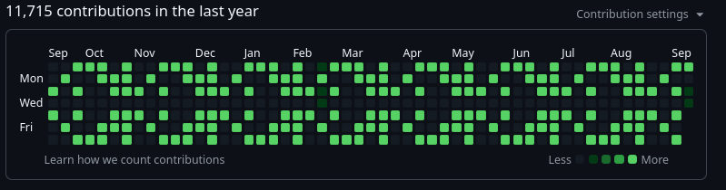
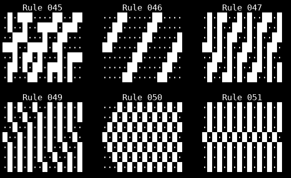

# git-tape



`git-tape` turns the GitHub contribution calendar into a programmable 7-pixel-high scrolling display.

The default pattern is an infinite prime-number ticker:

```text
2 3 5 7 11 13 17 19 23 29 ...
```

Each lit calendar cell is represented by a configurable number of dated Git commits, so the artwork can dominate the contribution heatmap while ordinary activity fades into the background.

## Contents

- [Why?](#why)
- [Quick start](#quick-start)
- [Patterns](#patterns)
- [Example rules](#example-rules)
- [Date ranges and previews](#date-ranges-and-previews)
- [Updating a canvas](#updating-a-canvas)
- [Architecture](#architecture)
- [License](#license)

## Why?

Mostly because contribution graphs are a terrible proxy for developer productivity.

Let's turn the metric into pixel art.

## Quick start

> **Warning: use a dedicated canvas repository, never a repository you use for
> normal coding.** git-tape does not enforce this restriction. Painting creates
> real commits on the currently checked-out branch and runs your Git commit
> hooks. Check the repository path and branch before painting, and do not switch
> branches, run another painting process, or perform other Git operations until
> it finishes. Painting holds Git's index lock for the entire run. Other Git operations may
> fail while it is running.

Painting modifies `.git-tape/paint.log` and includes the canvas README and config
in its first commit. Keep these files dedicated to git-tape. Running `init` again
overwrites the canvas configuration. Passing `--email` changes the repository's 
local Git email. Review the resulting history before pushing. The manual CLI does
not push automatically.

```bash
python3 -m venv .venv
source .venv/bin/activate
pip install -e .
```

Create a canvas:

```bash
git-tape init ~/git-tape-canvas --pattern primes --epoch 2025-12-28 --commits-per-pixel 100
```

New canvases use your configured Git `user.name`. Use `--name "Your Name"` to override it.
If Git has no name configured, `--name` is required. Existing canvases retain their
saved author name unless you change it with `git-tape config --name`.

Painting uses your configured Git `user.email`. Use an email linked to your GitHub account.
Override it for a run with `paint --email` or `GIT_TAPE_EMAIL`, or save a
canvas-specific email with `init --email` or `config --email`.

Preview it:

```bash
git-tape preview ~/git-tape-canvas
```

Paint it:

```bash
cd ~/git-tape-canvas
git-tape paint . --since 2026-01-01 --allow-backfill
```

Rerunning with the same configuration and history creates only the missing pixel
commits. Completed commits remain if a later pixel fails, rerun to resume.

## Patterns

- `primes` — endless prime-number ticker
- `text` — repeating text
- `rule` — elementary cellular automaton

Choose the pattern when creating a canvas. For example, create a rule 30 canvas
with one lit cell in the initial column:

```bash
git-tape init ~/git-tape-canvas --pattern rule --rule 30 --seed 0b0001000 --epoch 2025-12-28 --commits-per-pixel 10
```

`--rule` accepts integers from 0 to 255. Each calendar column is one generation
of a seven-cell automaton, with the top and bottom edges wrapping around.
`--seed` sets the initial column. Use a decimal integer from 0 to 127 or a
binary value such as `0b0001000`. The rightmost bit represents Sunday, the
leftmost Saturday and the default seed lights Wednesday.

For repeating text:

```bash
git-tape init ~/git-tape-canvas --pattern text --text "HELLO WORLD" --epoch 2025-12-28
```

Text uses a small 3×5 font inside the seven calendar rows. Lowercase letters
are rendered as uppercase, while unsupported characters become `?`.

`--commits-per-pixel` sets the number of commits for each lit day (default: 3).
All built-in patterns currently use either unlit or maximum-intensity pixels.
Higher counts create more commits and take longer to paint.

## Example rules



Browse all 256 elementary rules:

```bash
git-tape rule-gallery
```

For a smaller selection:

```bash
git-tape rule-gallery --start 30 --end 110 --weeks 20
```

Preview a single rule with a particular seed before creating a canvas:

```bash
git-tape rule-gallery --start 110 --end 110 --seed 0b0001000 --weeks 26 --columns 1
```

The gallery does not change your canvas configuration or create commits.

## Date ranges and previews

The **epoch** anchors the pattern to the calendar. It must be a Sunday and
defines column zero. Dates before it remain blank. If omitted during `init`,
it defaults to the Sunday on or before 364 days ago.

The **paint range** selects which dates receive commits. It does not restart
the pattern, each date keeps its position relative to the epoch.

For the rule canvas above, preview the first 13 weeks, then paint that exact
Sunday-to-Saturday range:

```bash
git-tape preview ~/git-tape-canvas --until 2026-03-28 --weeks 13
git-tape paint ~/git-tape-canvas --since 2025-12-28 --until 2026-03-28
```

To paint only a particular month:

```bash
git-tape paint ~/git-tape-canvas --since 2026-04-01 --until 2026-04-30
```

| Option                       | Meaning                                                                                    |
| ------------------------------| --------------------------------------------------------------------------------------------|
| `paint --since YYYY-MM-DD`   | First date to paint, inclusive. Defaults to 364 days before `--until`.                     |
| `paint --until YYYY-MM-DD`   | Last date to paint, inclusive. Defaults to today.                                          |
| `paint --allow-backfill`     | Allow missing commits on dates earlier than the latest existing pixel commit.              |
| `paint --allow-future`       | Allow an end date later than today, otherwise painting refuses it.                         |
| `preview --until YYYY-MM-DD` | Last date shown as a pattern pixel. Defaults to today.                                     |
| `preview --weeks N`          | Number of calendar columns shown, including the week containing `--until`. Defaults to 53. |

Both paint dates use `YYYY-MM-DD`, and the end must not precede the start.
With neither date supplied, painting covers 365 days ending today. Generated
commits are timestamped at noon UTC on their selected date.

Backfilling is needed only when adding missing pixels behind existing pixel
history, not simply because a date is in the past. For example:

```bash
git-tape paint ~/git-tape-canvas --since 2026-02-01 --until 2026-02-28 --allow-backfill
```

Preview renders the configured pattern without creating commits or reading
painted history. It has no `--since` option. Use `--weeks` to set the window
width. Days after `--until` in the final column appear as `··`.

These commands run once when invoked. The current CLI does not install a
scheduler or push commits automatically.

## Updating a canvas

Use `config` to change an existing canvas while retaining settings you do not
specify. For example, switch to rule 110 and preview it:

```bash
git-tape config ~/git-tape-canvas --pattern rule --rule 110 --seed 0b0001000
git-tape preview ~/git-tape-canvas --until 2026-03-28 --weeks 13
```

You can also switch to text or change the target commit count:

```bash
git-tape config ~/git-tape-canvas --pattern text --text "HELLO WORLD"
git-tape config ~/git-tape-canvas --commits-per-pixel 20
```

Configuration changes do not rewrite existing commits. Painting only adds
missing commits. So increasing the count can top up existing pixels, but lowering
it does not remove commits. Switching patterns does not erase the old art.
Changing `--epoch` also changes the pattern's alignment without moving existing commits.

For the complete options for any command:

```bash
git-tape init --help
git-tape config --help
git-tape paint --help
git-tape preview --help
```

## Architecture

```text
src/git_tape/cli.py        arguments, commands, and summaries
    │
    ├── config.py         canvas settings, validation, and saving
    │
    ├── patterns.py       prime ticker, repeating text, and cellular automata
    │   └── font.py       7-pixel-high character glyphs
    │
    ├── planner.py        compare desired pixels with existing commits
    │   ├── calendar.py   map dates to pattern columns and rows
    │   └── gitrepo.py    dated commits, index locking, and recovery
    │
    ├── render.py         terminal preview of the calendar window
    └── gallery.py        terminal gallery of elementary rules
```

## License

git-tape is free software, you can redistribute it and/or modify it under
the terms of the GNU General Public License as published by the Free Software
Foundation, either version 3 of the License, or (at your option) any later version
(`GPL-3.0-or-later`).

It is distributed without any warranty, including the implied warranties of
merchantability or fitness for a particular purpose. See [LICENSE](LICENSE)
for the full terms.
